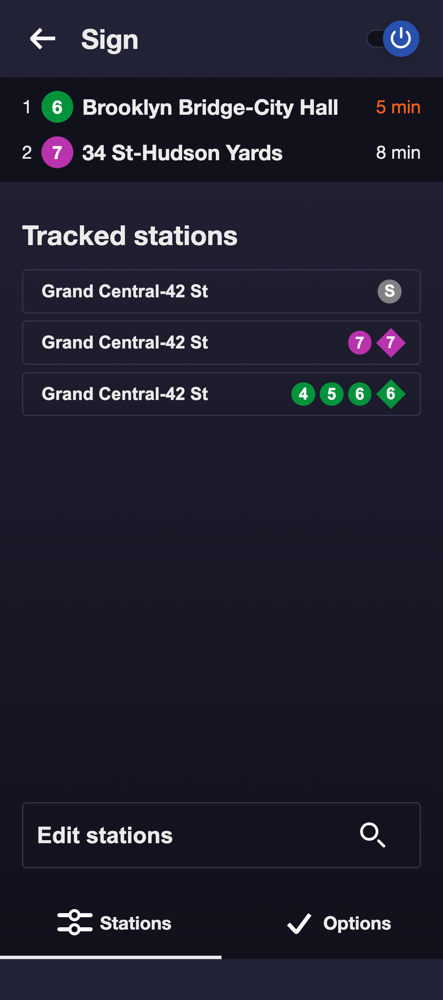

# The Subway Arrivals Sign App


The subway arrivals sign is a CircuitPython-powered LED sign which displays the upcoming train arrivals at the subway stations of your choosing! This repository contains the code for the web app which you will use to configure and manage your sign.

## Project overview
The subway arrivals sign needs three overall components in place to get up and running:
1. [The subway arrivals sign API](https://github.com/dzaharia1/subway-schedules) (START WITH THIS TUTORIAL)
2. The subway arrivals web app (this repository)
3. [The subway sign itself](https://github.com/dzaharia1/subway-sign-python), which runs on a wifi-enabled CircuitPython board custom-made to drive the an LED matrix.

This tutorial will cover the deployment of the app.
__*YOU MUST FIRST [SET UP THE API](https://github.com/dzaharia1/subway-schedules) FOR THIS TUTORIAL TO WORK*__

## A bit more about this app
This app is a next.js React application which uses the subway-schedules api to change the settings of your subway sign. You can use it to manage any subway sign you have already set up. Once the app is deployed, I suggest using Safari or Chrome on your phone to access it, and add it to your home screen for easy access.

_The app currently does not support adding and removing signs from the database. If you want to make new signs, you will have to add them to the database according to the "Add your first sign" step in [this tutorial](https://github.com/dzaharia1/subway-schedules)._ 

## Deploying and running the app
### Clone this repository and configure the app
```bash
$ git clone https://github.com/dzaharia1/subway-sign-app.git
$ cd subway-sign-app
```

### Option A: Deploy to Firebase App Hosting (Recommended)

This app can be deployed to Firebase App Hosting for zero-config, fully managed SSR deployment:

1. Create a Firebase project (e.g. `subway-arrivals`) in the [Firebase Console](https://console.firebase.google.com/).
2. Upgrade your Firebase project to the **Blaze** plan (pay-as-you-go).
3. Ensure the `apphosting.yaml` and `firebase.json` files are present in the repository root.
4. Edit the `apphosting.yaml` file to set your `API_URL` environment variable pointing to your deployed API:
   ```yaml
   env:
     - variable: API_URL
       value: "https://your-api-name.herokuapp.com"
   ```
5. In the Firebase Console, navigate to **App Hosting**, click **Get Started**, connect your GitHub account, and select this repository.
6. Push your code to your main branch. Firebase will build and deploy the app automatically!

### Option B: Deploy this code to Heroku

Very similarly to the API, we will deploy this code as a new application on Heroku. In your terminal, `cd` to the parent directory of the folder we cloned the subway-schedules api. Then run a git clone on this repository, create a new Heroku app, and deploy to that app. Replace `<APP NAME>` with a unique name for your app:

```bash
$ heroku create -a <APP NAME>
```

Log into your Heroku dashboard, and open the newly created app. On the settings tab, under Config vars, click `Reveal config vars`. Add a line item with a key of API_URL. For the value, input the URL to your API, starting with https. It should take the form of `https://<YOUR API NAME>.herokuapp.com`. Then click `Add` to save the config var.

Now deploy the app
```bash
$ git push heroku master
```

### Check the running app and configure your sign
Visit your running app at https://`<APP NAME>`.herokuapp.com, where `<APP NAME>` is the name that you created your app with. At the prompt, enter the ID for the sign you created when you deployed the API, and then hit "Find my sign."

You should see an interface with the entire default configuration you created. You can use this page to freely edit any aspect of the sign's configuration! Once we get the sign running, all configuration you've done here will affect the sign's behavior.

### Now go build your sign!
Home stretch! It's finally time to build your sign. Follow the tutorial at the [subway-sign repository](https://github.com/dzaharia1/subway-sign-python) to make the physical sign and connect it to your API!